# Employee Attrition Analysis Project (Slatium HR Case Study)

#### Workforce Retention & Risk Insights

### Table of Contents
* [Overview](#overview)
* [The Problem](#the-problem)
* [Stakeholders](#stakeholders)
* [Business Questions](#business-questions)
* [Key Insights](#key-insights)
* [Recommendations](#recommendations)
* [Expected Outcomes](#expected-outcomes)
* [Next Steps](#next-steps)

### Overview

This project analyses attrition across 1,470 employees at Slatium, a mid-to-large IT organisation, to understand why the company is losing staff at a 16.12% rate and where that risk actually concentrates, so HR can act on specific groups instead of running organisation-wide initiatives that dilute effort and budget.

*Note: Attrition, as used here, refers to employees recorded as having left the company in the dataset; replacement hiring is not tracked.*

### The Problem

Slatium is experiencing a significant rate of employee attrition, particularly in specific job roles and departments. Turnover at this scale increases operating costs, disrupts team stability, reduces productivity, and threatens long-term talent retention. The goal of this analysis was to calculate the attrition rate and identify which demographic and work-related factors are actually associated with an employee leaving.

### Stakeholders

- **Client:** HR Team (People & Culture Department)
- **organisation type:** Mid-to-large IT company
- **Key stakeholders:** Senior Management/Executives, HR Leadership, Department Heads (R&D, Sales, HR)

### Tools
1. MySQL
2. Tableau
3. Microsoft PowerPoint

### Key Performance Indicators
- Attrition Rate: 16.12%
- Attrition Count: 237
- Average Income: $6,503
- Total Employees: 1,470
- Retention Count: 1,233
- Average Tenure: 7 years

### Data Visualisation: Business Dashboard
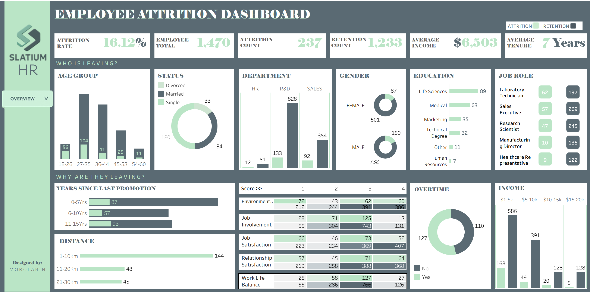

### Business Questions

1. How does attrition vary across departments, roles, and job levels?
- Objective: Measure attrition rates across departments and roles.
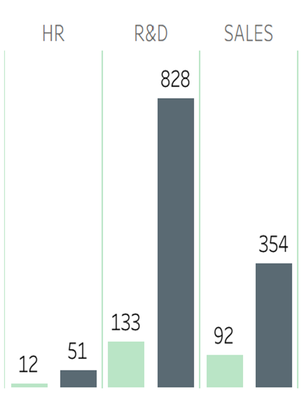
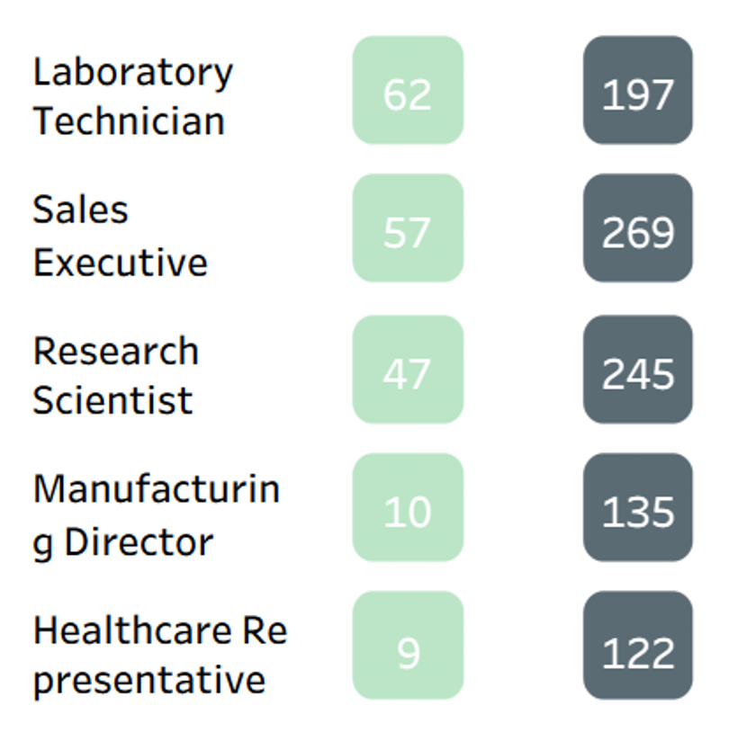

2. Which demographic and work-related factors are associated with attrition?
- Objective: Identify demographic and work-related factors linked to attrition.
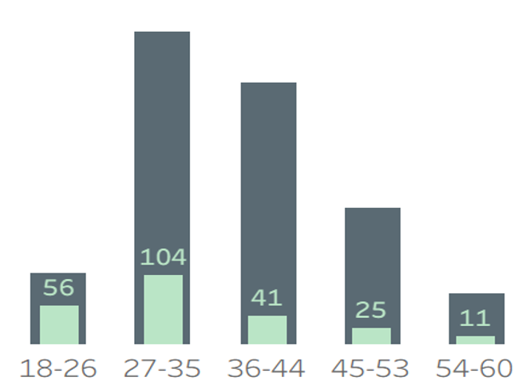
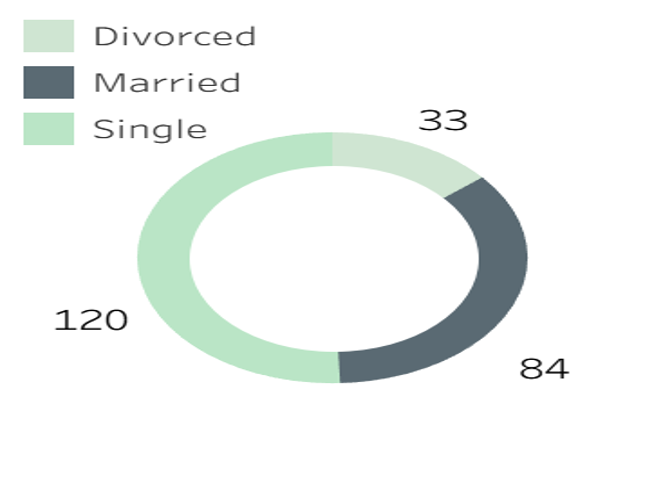
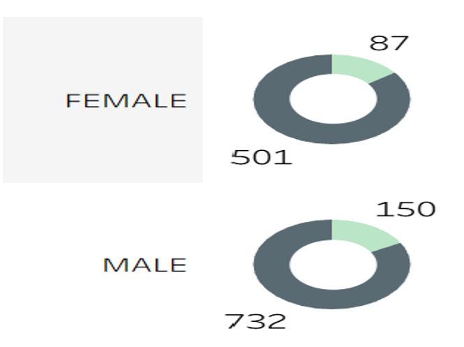
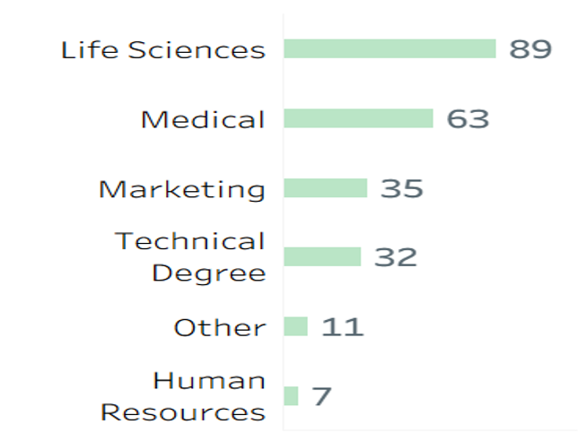

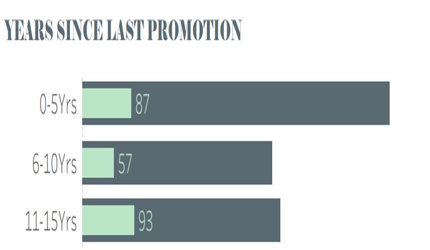
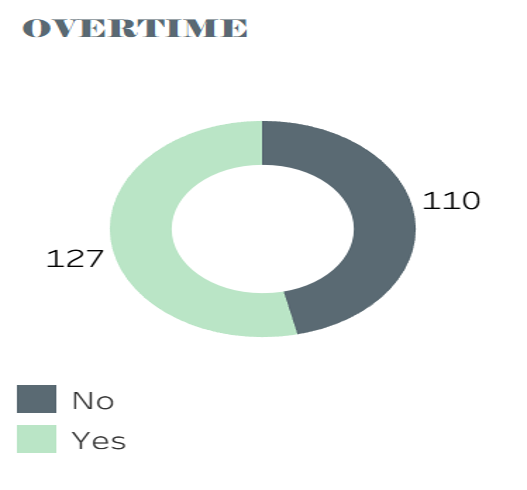
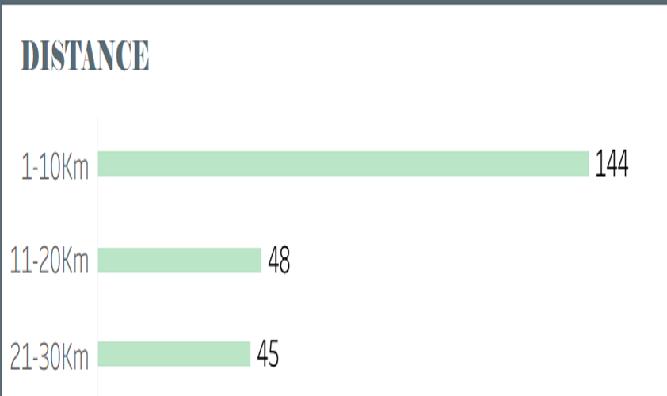
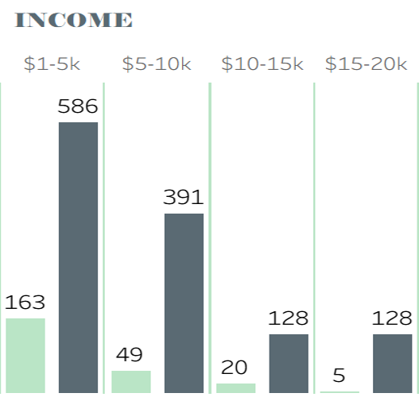

3. How do satisfaction metrics relate to employee attrition?
- Objective: Analyse satisfaction metrics and their relationship with attrition.
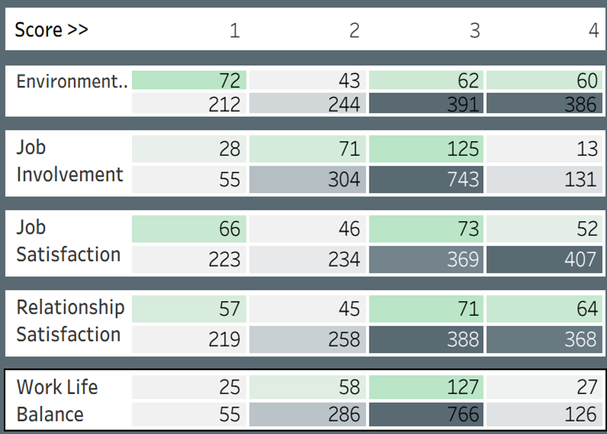

### Key Insights

---

*Dataset: Slatium HR employee records (1,470 employees) · Built in Excel: Power Query for ETL, PivotTables/PivotCharts for analysis and dashboarding.*

Link to the dashboard: https://public.tableau.com/app/profile/mobolarin/viz/HREmployeeAttritionDashboard_17631605584070/HR 
